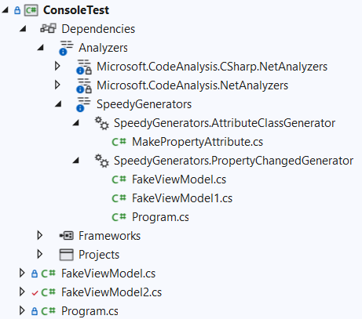

# SpeedyGenerators

C# code generators are new to C# version 9.

Apart from straightforward cases, the greatest majority of the code is generated using the Roslyn (C# compiler) API.

All the code in the NuGet package is only used at development time. There is no run-time dependency, therefore you don't need to deploy the binaries for this package.

The generation process happens thanks to the C# compiler. This means it works even if the build is done on the command line. In other word there is no dependency from Visual Studio or other IDEs.

Once the package is referenced in the application, just start coding as shown in the examples. The generated code can be examined by expanding the Analyzers tree:

