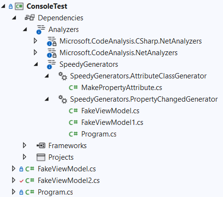

# SpeedyGenerators

       

C# code generators are new to C# version 9.

Apart from straightforward cases, the greatest majority of the code is generated using the Roslyn (C# compiler) API.

All the code in the NuGet package is only used at development time. There is no run-time dependency, therefore you don't need to deploy the binaries for this package.

The generation process happens thanks to the C# compiler. This means it works even if the build is done on the command line. In other word there is no dependency from Visual Studio or other IDEs.

Once the package is referenced in the application, just start coding as shown in the examples. The generated code can be examined by expanding the Analyzers tree:



## Implementing `INotifyPropertyChanged`

The first generator involved is the `MakePropertyAttribute` which is always generated so that it can be used without needing any runtime dependency.

A potential future breaking change is its namespace. The current namespace for the attribute is `SpeedyGenerators` but I am thinking to change it to the root namespace of the target process.

The second generator is the one producing the code to implement the `INotifyPropertyChanged` interface.

The code you are expected to write in your class is the following:

- The `using` declaration needed to use the `MakeProperty` attribute.
- Making the class (in this case `FakeViewModel`) `partial`. If you forget it, the compiler will produce an error saying that another class exists with the same name but with the partial modifier.
- Write the private field (in this case `_x`) and tag it with the `MakeProperty` attribute
  - The only mandatory parameter of the attribute is the name of the property being generated.
- Every comment applied to the field will be copied to the generated property.

#### Code written from the developer:

```c#
using SpeedyGenerators;

namespace ConsoleTest_Extra
{
    internal partial class FakeViewModel
    {
        /// <summary>
        /// The comment is copied
        /// to the generated property
        /// </summary>
        [MakeProperty("X")]
        private int _x;
    }
}
```


#### Code generated as a partial class under the Analyzer tree:

```C#
using System;
using System.Collections.Generic;
using System.ComponentModel;
using System.Runtime.CompilerServices;

#nullable enable
namespace ConsoleTest_Extra
{
    internal partial class FakeViewModel : INotifyPropertyChanged
    {
        
        /// <summary>
        /// Event triggered when a property changes its value
        /// </summary>
        public event PropertyChangedEventHandler? PropertyChanged;
        protected virtual void OnPropertyChanged([CallerMemberName] string? propertyName = null)
        {
            this.PropertyChanged?.Invoke(this, new PropertyChangedEventArgs(propertyName));
        }

        
        /// <summary>
        /// The comment is copied
        /// to the generated property
        /// </summary>
        public int X
        {
            get => _x;
            set
            {
                _x = value;
                OnPropertyChanged();
            }
        }
    }
}
#nullable restore

```


### Optional parameters: ExtraNotify

The first optional parameter is `ExtraNotify`.

```C#
[MakeProperty("Name", true)]
private string? _name;
```

The following code is generated.

```C#
/// <summary>
/// </summary>
public string? Name
{
    get => _name;
    set
    {
        var oldValue = _name;
        _name = value;
        OnPropertyChanged();
        OnNameChanged(oldValue, _name);
    }
}

partial void OnNameChanged(string? oldValue, string? newValue);
```

This allows you to be notified inside the OnNameChanged by writing the following method below the field declaration:

```C#
partial void OnNameChanged(string? oldValue, string? newValue)
{
    Console.WriteLine($"{oldValue} -> {newValue}");
}
```


### Optional parameters: CompareValues

The second optional parameter is `CompareValues`.

```C#
[MakeProperty("Description", false, true)]
private string? _description;
```

The following code is generated.

```C#
/// <summary>
/// </summary>
public string? Description
{
    get => _description;
    set
    {
        if (_description == value)
            return;
        _description = value;
        OnPropertyChanged();
    }
}
```

The optional parameters can be, of course, combined together.

### Final Notes

* The generated code supports adding the `using` declaration for types in other namespaces. For example, if the type is a `ObservableCollection`, the `using System.Collections.ObjectModel;` is added automatically.

* The original class may already have multiple partial classes. A single partial class will be generated.

* Two or more classes may have the same name but in different namespaces. In this case a progressive number is added to the file containing the generated code, as the C# code generators need a unique file name for the generated code.

* If the `INotifyPropertyChanged` interface is implemented in any of the base classes, the generator finds it and of course does NOT generate the event or even the `OnPropertyChanged` method.

  > Any event can only be invoked by a member of the same class and not from derived classes.

  In this case the generator examines the base class where the event is declared and looks for a method containing `PropertyChanged` in its name, with a single parameter of type string.

  If that is found, the generated code in the property setters will invoke that method.
  If that method is not found (because it has a different name), the generator will call anyway the **non-existent** `OnPropertyChanged` method. This method **is required** and must be manually written by the developer. The code inside this method should just call the method in the base class that can raise the event.

## Issues

Please use the Issues on the GitHub repository to provide bugs and suggestions.

